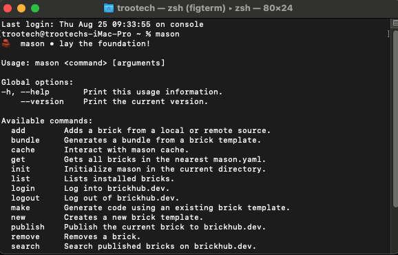

# Reusable Bricks using 🔨 [Mason CLI Package](https://pub.dev/packages/mason_cli)

## Installation

1. **Using `pub`** :

   - `dart pub global activate mason_cli`

   <br/>

2. **Using `brew`** :

   ```
   brew tap felangel/mason
   brew install mason
   ```

- Run `mason` command inside terminal to check if it is successfully installed or not

<p align="center">
  
</p>

<br/><br/>

## Clone

- Clone [this](https://bitbucket.org/dhruv-nakum/troo_mason/src/master/) repository.

<br/><br/>

## Run

- Run `mason get` command to get all the bricks.
- After that run below command to add the bricks globally in order to use it in any project

  ```
  mason add name_of_brick --path ./path/to/my_brick --global
  ```

  Ex :

  ```
  mason add troo_bloc_feature --path ./bricks/troo_bloc_feature --global
  ```

- After that check if it successfully added or not by running below command.

  ```
  mason ls -g
  ```

---

<br/>

## Using mason inside project

- In order to use mason inside project run :

  ```
  mason make name_of_brick
  ```

---

<br/>

## Refere [this](https://github.com/felangel/mason/tree/master/packages/mason_cli#creating-new-bricks) to create your own brick.

---

<br/>

# troo_bloc

```
- bloc
|- example_bloc.dart
|- example_event.dart
|- example_state.dart
```

<br/>

# troo_bloc_feature

```
- exampleFeature
|- bloc
  |- example_bloc.dart
  |- example_event.dart
  |- example_state.dart

|- data
  |- api
    |- example_api.dart
  |- models
    |- example_model.dart
  |- repositories
    |- example_repository.dart

|- view
  |- example_page.dart

|- widgets
  |- example_widget.dart
```

<br/>

# troo_bloc_structure

```
- assets
  |- translations
    |- en.json
    |- es.json
    |- IMP.md
  |- images
  |- fonts

- lib
  |- app
     |- view
        |- app.dart

  |- core
     |- constants
        |- app_constants.dart
        |- app_text_styles.dart
        |- app_theme.dart
        |- colors.dart

     |- local
        |- shared_pref
            |- helper.dart
            |- pref_keys.dart
            |- preference.dart

     |- network
        |- client
            |- dio_client.dart
            |- dio_exception.dart
        |- endpoints
            |- endpoints.dart
        |- interceptor
            |- dio_interceptor.dart

  |- features
     - home
        |- bloc
            |- home_bloc.dart
            |- home_event.dart
            |- home_state.dart

        |- data
            |- api
                |- home_api.dart
            |- models
                |- home_model.dart
            |- repositories
                |- home_repository.dart
        |- view
            |- home_page.dart

        |- widgets
            |- home_text.dart

  |- global_widgets
    |- base_app_bar.dart

  |- routes
    |- app_routes.dart

  |- utils
    |- connection
        |- connection.dart
    |- device
        |- device_type.dart
    |- permission
        |- permission_handler.dart
    |- platform
        |- platform.dart

  |- main.dart

- pubspec.yaml
```

## Packages Used inside this Brick

```
cupertino_icons: ^1.0.2
flutter_bloc: ^8.1.1
easy_localization: ^3.0.1
flutter_screenutil: ^5.5.3+2
connectivity_plus: ^2.3.6+1
permission_handler: ^10.0.0
dio: ^4.0.6
logger: ^1.1.0
```

<br/>

# troo_getx_feature

```
- example_feature
    |- data
        |- api
            |- example_api.dart
        |- models
            |- example_model.dart
        |- repositories
            |- example_repository.dart

    |- view
        |- example_page.dart

    |- widgets
        |- example_widget.dart

    |- bindings.dart
    |- controller.dart
```

<br/>

# troo_getx_structure

```
- lib
  |- app
     |- view
        |- app.dart

  |- core
     |- constants
        |- app_constants.dart
        |- app_text_styles.dart
        |- app_theme.dart
        |- colors.dart

     |- local
        |- shared_pref
            |- helper.dart
            |- pref_keys.dart
            |- preference.dart

     |- network
        |- client
            |- dio_client.dart
            |- dio_exception.dart
        |- endpoints
            |- endpoints.dart
        |- interceptor
            |- dio_interceptor.dart

  |- di
    |- service_locator.dart

  |- features
        - home
            |- data
                |- api
                    |- example_api.dart
                |- models
                    |- example_model.dart
                |- repositories
                    |- example_repository.dart

            |- view
                |- example_page.dart

            |- widgets
                |- example_widget.dart

            |- bindings.dart
            |- controller.dart


  |- routes
    |- pages.dart
    |- routes.dart

  |- translation
    |- en_MX
        |- en_mx.dart
    |- en_US
        |- en_us.dart
    |- app_translation.dart

  |- utils
    |- connection
        |- connection.dart
    |- device
        |- device_type.dart
    |- permission
        |- permission_handler.dart
    |- platform
        |- platform.dart

  |- main.dart
```
